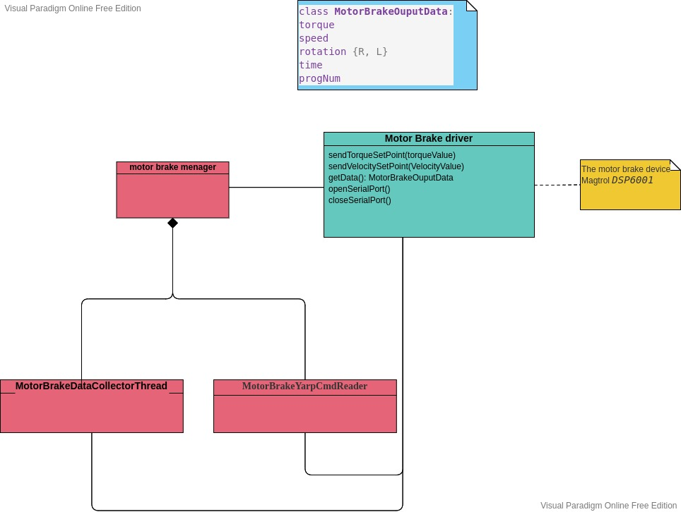

# Motor Brake Manager 

Motor Brake Manager is an utility for interacting with a motor brake device by command line and/or by yarp ports.

The main functionalities of the Motor Brake Manager are:
 - read the motor brake data, like torque and speed and dumps them on file and/or publishes them on a yarp port
 - send torque and speed setpoints to the motor brake device
 - send a custom command to the motor brake device

In the next sections you can find instruction on how to interact with the device using the command line and yarp ports.

## How to install 
The Motor Brake Manager is a small set of python scripts so you need python3 to run it.
Moreover the following packages are necessary:
 - `matplotlib`
 - `termcolor`
 - `colorama`
 - `serialport`

If you are interesting in yarp services also, you need to install yarp with python binding enabled (set `ON` the `ROBOTOLOGY_USES_PYTHON` CMake option).

Alternatively, you can use the docker images available [here](https://hub.docker.com/r/valegagge/setupmotorbrake) that has already installed all needed packages and yarp.

## How to run 
Before running this application please check that the device and its driver are correctly configured in order to use Nm for torque value and deg/sec for speed values. 
In the case of `Magtrol DSP6001`, check that the measure unit of torque is `mNm` and `rpm` for the speed. The driver takes care to convert the data correctly.

After these verifications, you need to just type `python3 motorBrakeManager.py` .

**NOTE**: if you notice this error string: 
```
swig/python detected a memory leak of type 'yarp::os::Type *', no destructor found 
``` 

don't take care of it because it is a well know problem related to yarp and it doesn't affect the behavior of the Motor Brake Manager.


### Start options
If you run the Motor Brake Manager with `--help` option you get all available options, that are reported here:


 - `h, --help                   show this help message and exit`
 - `y, --yarpServiceOn          enable yarp service (default: False)`
 - `d, --daemon                 starting as daemon, without menu for user interaction (default: False)`
 - `f FILE, --file FILE         name of file where log data (default: )`
 - `p PERIOD, --period PERIOD   acquisition data period(seconds) (default: 0.015)`
 - `s SERIALPORT, --serialPort SERIALPORT  Serial port (default: /dev/ttyUSB0)`
 - `b BAUDRATE, --baudrate BAUDRATE        Serial port baud rate (default: 19200)`

It is important to note that in `daemon` mode the acquisition is started automatically; the data are dumped in the file given by `--file` option and published on the `/motorbrake/out` yarp port.

In case the `--file` option is not specified, so the filename is empty, the data aren't dumped on any file.

It should be better that the acquisition data period is not less than the default value (0.015ms) because, after some tests, I noticed that the average period to get dat is about 12 ms.

If you are interested in publishing the motor brake data on port yarp and/or in commanding the device by a yarp port, you need to use the option `yarpServiceOn`. See the section __yarp service__ for more detail.


### Command menu
The commands available in the prompt are:
 - `[1] : Get Magtrol Id and revision` : gets the ID end revision 
 - `[2] : Start data acquisition` : starts the data acquisition in background. When this option is chosen, the utility ask the name of file where save the retrieved data; if it isn't  provided the data are not saved on file.
 - `[3] : Stop data acquisition`: stops the data acquisition
 - `[4] : Send torque setpoint`: sends a torque setpoint. When this option is chosen, the utility ask the value to the user. The value is in Nmm.
 - `[5] : Send speed setpoint`: sends a speed setpoint. When this option is chosen, the utility ask the value to the user. The value is in deg/second.
 - `[6] : Custom`: sends a custom command
 - `[7] :  Enable/disable acquisition timing ` : enables/disables prints about acquisition timing, i.e. the average of time for get data from the device
 - `[7] : Quit` : exit from the application closing all yarp services also, if they have been anabled.

## Yarp service
If the MotorBrakeManager is launched with the option `--yarpServiceOn`, it opens the port `/motorbrake/cmd:i` for receiving command to forward to the device and publish on port `/motorbrake/out` the data read by the device.

### How to send command to the motor brake by yarp port
You need to send the following commands to the port `/motorbrake/cmd:i`:
 - `torque <torque_value>`: send the torque setpoint (also with decimal digit ) expressed in nNm
 - `speed <speed_value>` :  send the speed setpoint (also with decimal digit ) expressed in rpm
Other commands are ignored.

### Motor brake data published on yarp port
When the user enables the data acquisition option, the MotorBrakeManager starts a thread with the period specified by the user by `--period` option (otherwise 0.015 second is used); such thread collects speed and torque values from the device and publish them on yarp port `/motorbrake/out`. It writes 3 values: speed (deg/sec), torque (Nm) and `R` or `L` to indicate the direction.


## Implementation details

The Motor brake manager is a multi threading application not hardware dependent. 
This application now works with the device Magtrol DSP6001, but if you want to use with a different device it is sufficient to implement a new driver with the same interface of the deployed in the file motorBrakeDriver.py.

Here is reported the class diagram.


If you go through the code you can find more information about each class.

The device driver takes care to transform retrieved torque values in Nm and retrieved speed values in deg/sec.

